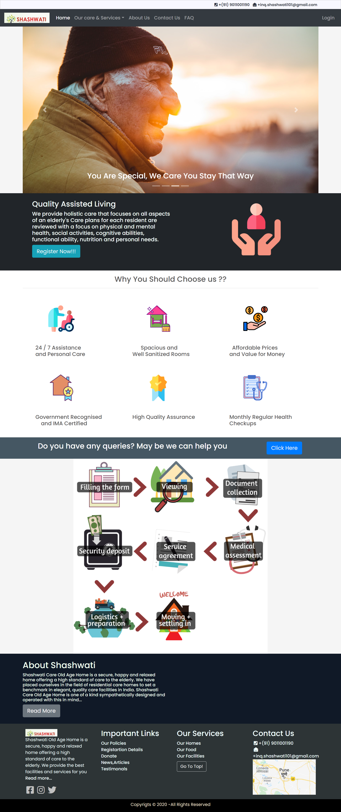
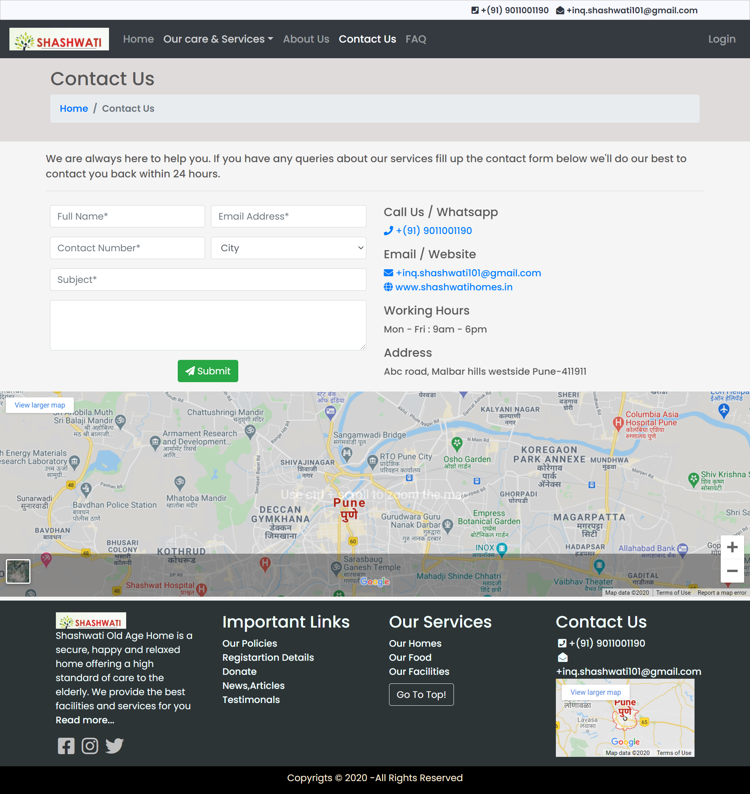
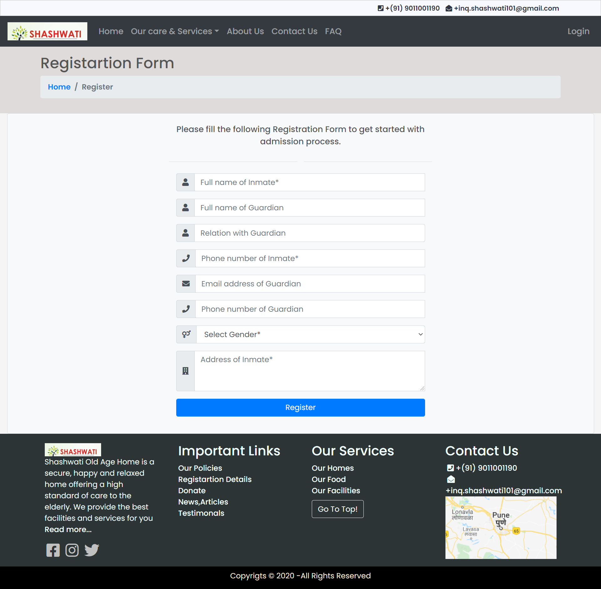
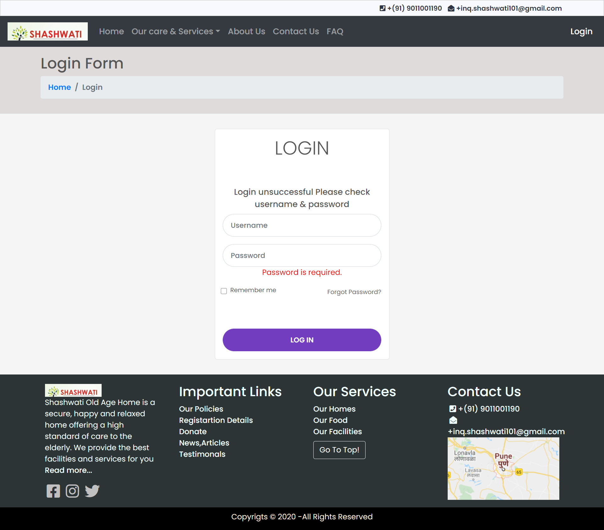

# Old Age Home Website

## Welcome! 👋

Thanks for checking out this repository.

## Tech Stack :
- HTML5
- CSS3
- BOOTSTRAP 4
- BASIC KNOWLEDGE OF JAVASCRIPT
- BASIC KNOWLEDGE OF PHP
- RDBMS 

## Abstract :

The website provides information about the old age home user can get all the required information at one place and they can also start primary registration process or contact old-age home if they have any queries, which will save the time and efforts. 
This project will be helpful for most of the old age homes which are located in the tier-2 and tier-3 cities and lack various aspects like technology. Some of the old age homes and elderly care centers which are operated by small NGO’s would also be benefitted with the help of this project. This system is user friendly and user can interact easily. The admin will have rights to see all the registration and contact us details that user has submitted.  

## Introduction :

- •	User can get various information about the old age home by exploring the website.
- • User can fill the primary registration form if he/she is interested
 and start the admission process.
- • Personal information of user is required for registration of the user 
or his/her relatives.
- • User can contact the old-age home filling the contact us form given on the website if they have any queries.
- •	Admins will have rights to see the data submitted by the users.

## Software Requirements :
The software interface uses a XAMPP (Cross platform, Apache, MySQL, PHP and Perl) set-up. ∙ Operating system: Windows 7/Ubuntu 16.04 LTS or above versions.
- ∙	Web Server: Apache 2.4.0
- ∙	Database: MySQL 5.7.3
- ∙	Scripting Language: PHP, JavaScript
- ∙	Web Browser: Mozilla Firefox, Chrome
- ∙	Front End of Website: HTML5, JavaScript, CSS3, Bootstrap 4.5

## Screenshots

Home Page

 

Contact Us Page

 

Registration Page

 

Login Page

